# 基于Java+SpringBoot+Vue学生成绩管理系统(源码+数据库)

### 作者QQ：3275035005 微信：xkbishe123 (支持修改、 部署调试、 代做接毕业设计和课程设计)

### 网站建设、小程序、H5、APP、各种系统、样式修改、10000套源码可选。

### 选题+开题报告+任务书+程序定制+安装调试+论文+答辩ppt 都可以做

### 问题包修改，包满意，有需求尽管甩过来！一条龙帮你安心过！

### 所有项目以及源代码本人均调试运行无问题 可支持远程调试运行

# 项目介绍
基于Java+SpringBoot+Vue学生成绩管理系统-毕业设计，本系统分为三个角色学生、教师、管理员项目采用前后端分离开发。

### 1. 学生

登录、查看首页信息、查看课程表信息、查看成绩信息、查看成绩分析、修改密码、修改个人信息、退出登录。

### 2. 教师

登录、查看首页信息、课程表管理、成绩信息管理、查看成绩分析、修改密码、修改个人信息、退出登录。

### 3. 管理员

登录、查看首页信息、课程信息管理、课程表管理、成绩信息管理、查看成绩分析、学生用户管理、教师用户管理、管理员用户管理、账号信息管理、修改密码、修改个人信息、退出登录。

# 技术框架
- 开发语言：Java
- 数据库：Mysql5.7以上
- 系统环境：jdk8、maven、node
- 后端框架：SpringBoot、MyBatis
- 前端框架：Vue、ElementUI
- 工具：IDEA、Navicat
- 技术架构：前后端分离、B/S架构、MVC架构
# 项目截图

### 1. 学生端

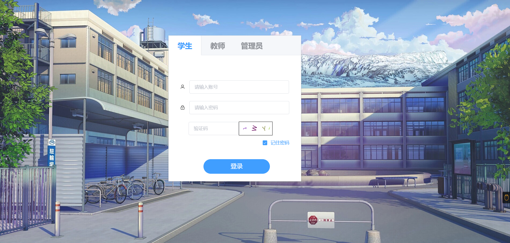

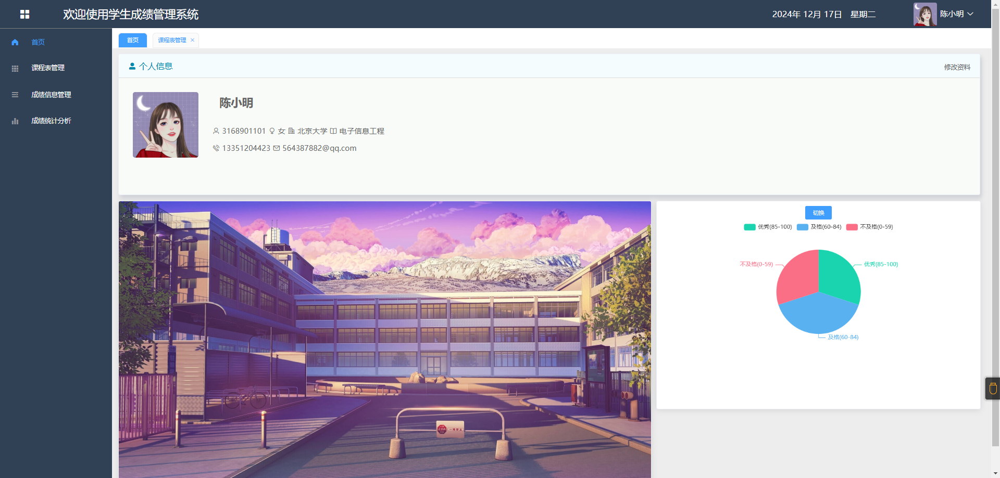

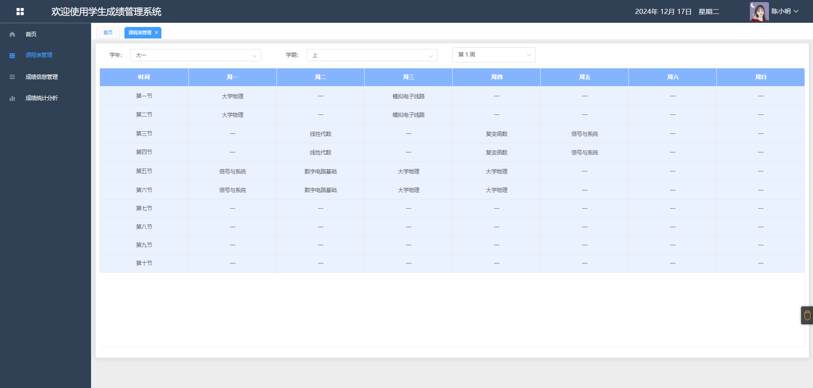

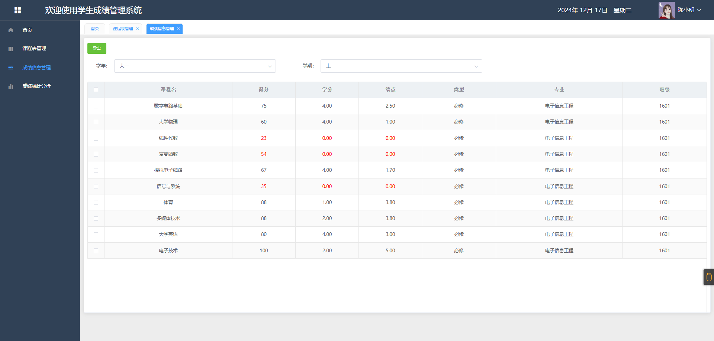

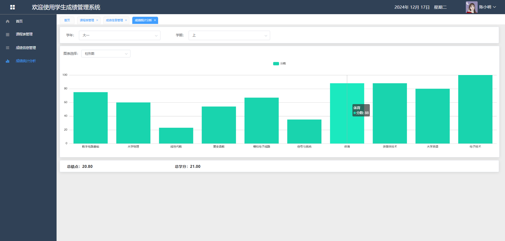

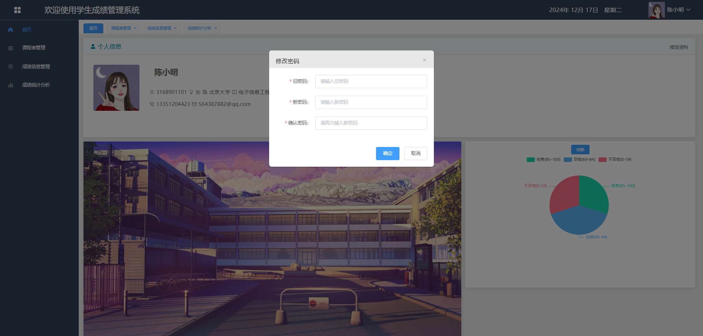

### 2. 管理员端

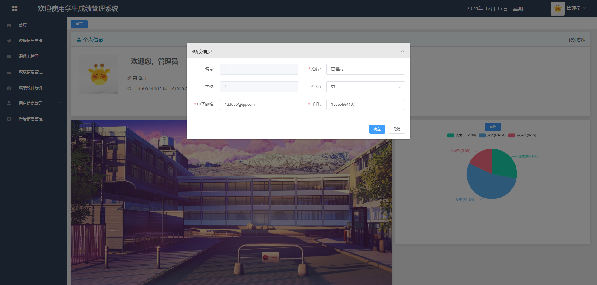

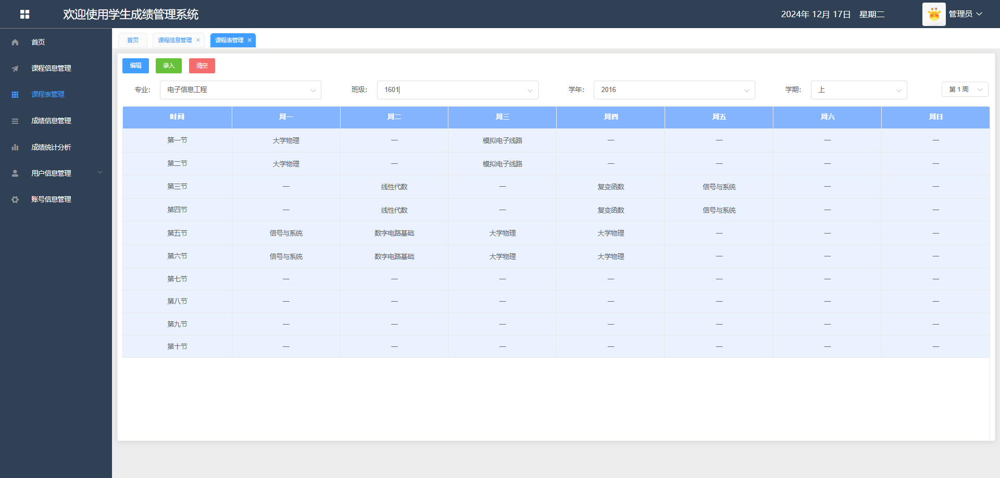

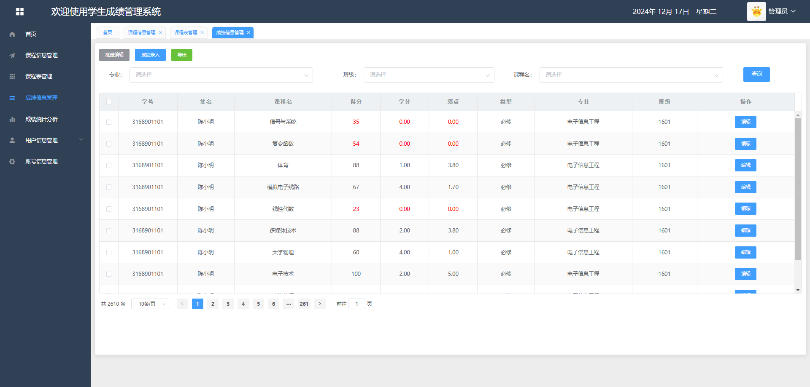

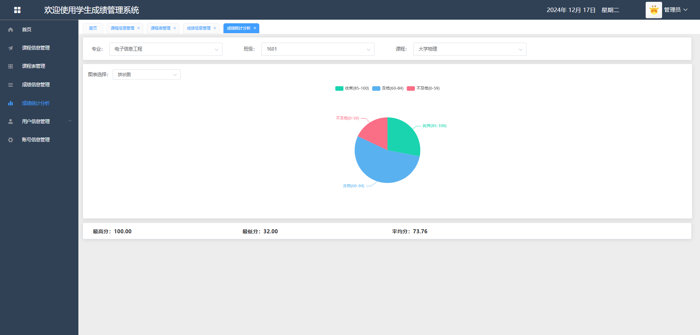

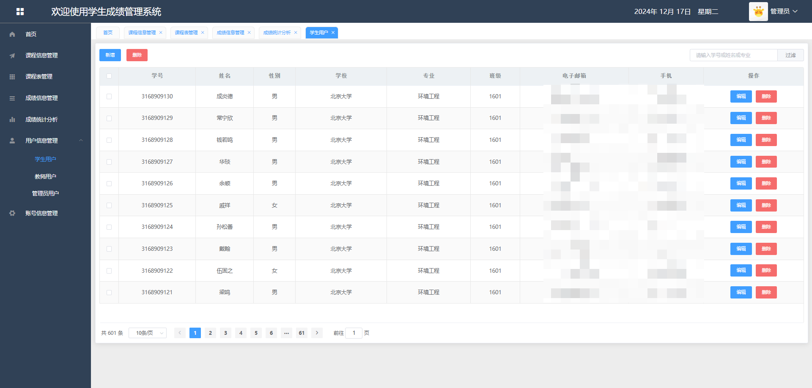

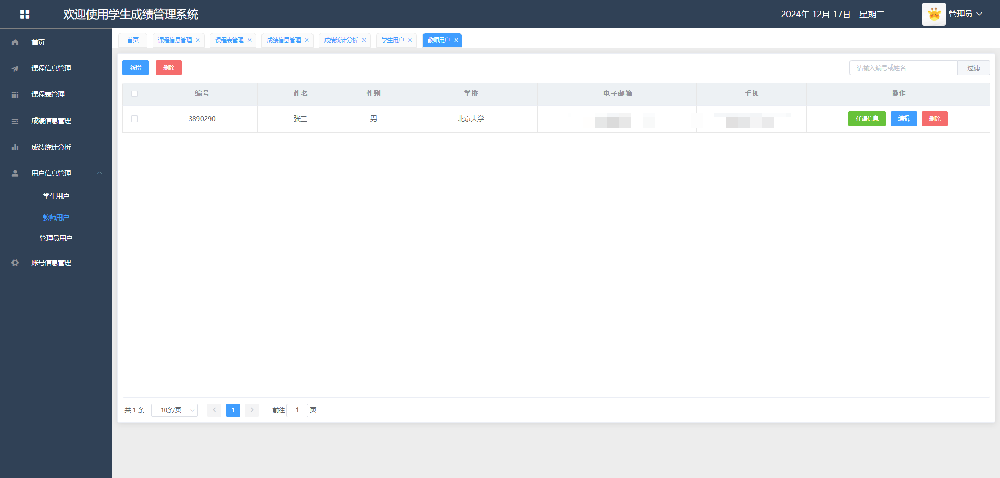

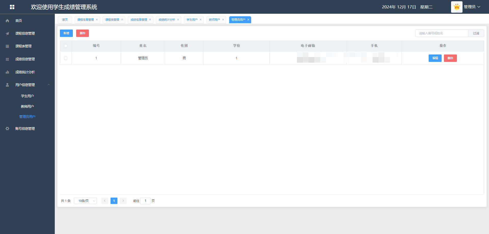

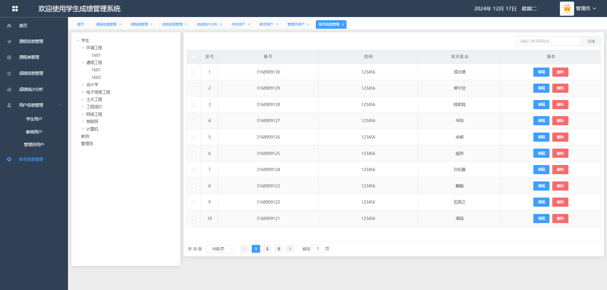

### 3. 教师端

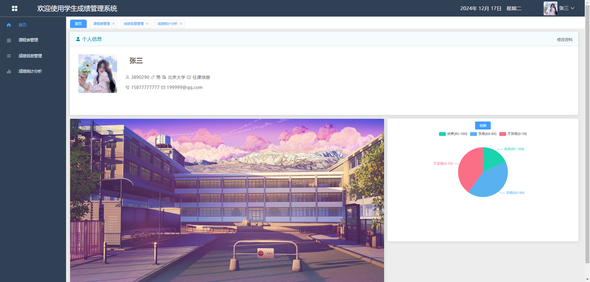

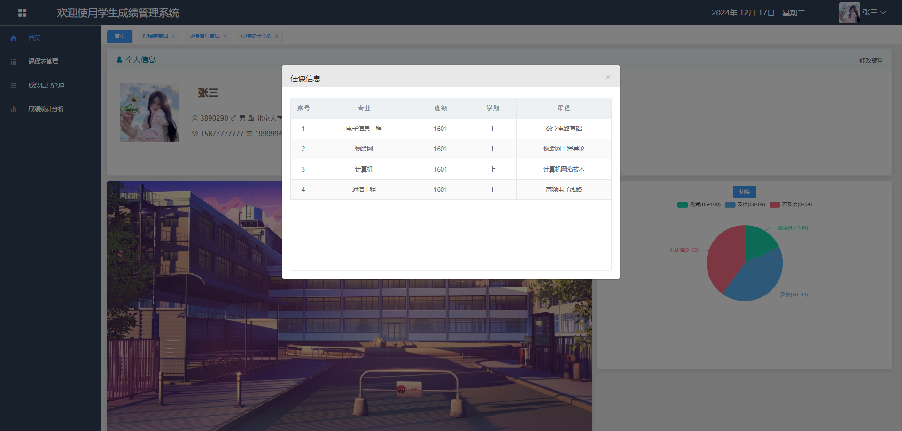

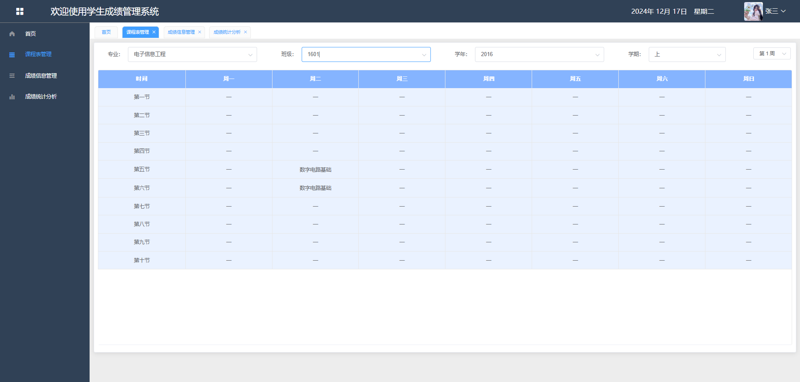

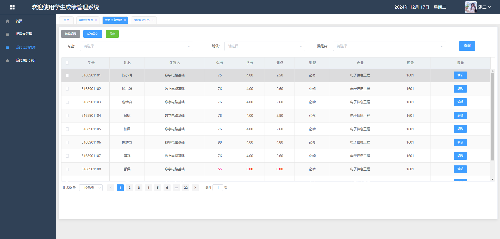

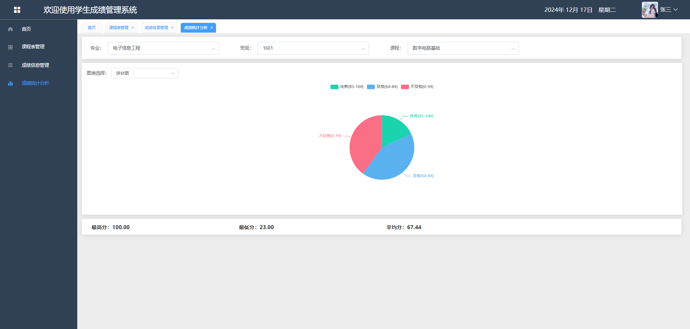

